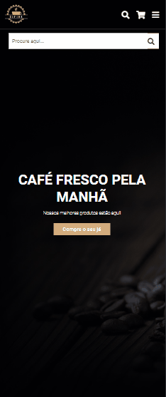

<h1 align="center">Results summary component</h1>

  Projeto do Front-End Mentor para praticar conhecimentos em HTML e CSS.

  

 

## 🚀 Tecnologias

Esse projeto foi desenvolvido com as seguintes tecnologias:

- HTML e CSS
- Git Github

## 💻 Projeto

Results summary component é uma página de resultados. Futuramente irei colocar os resultados com JS.

## Como ficou o projeto online

  

  
<a href="https://front-end-mentor-result.vercel.app/" target="_blank">Clique para</a> acessar o link</a>
  

## Conclusão

Mesmo eu não sabendo muito de display: grid, consegui fazer o projeto.